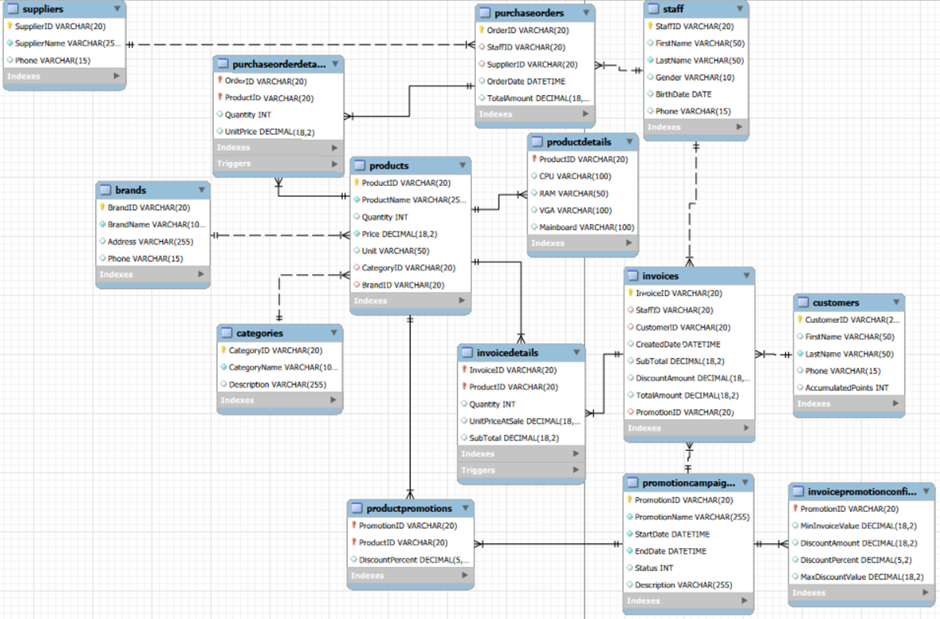
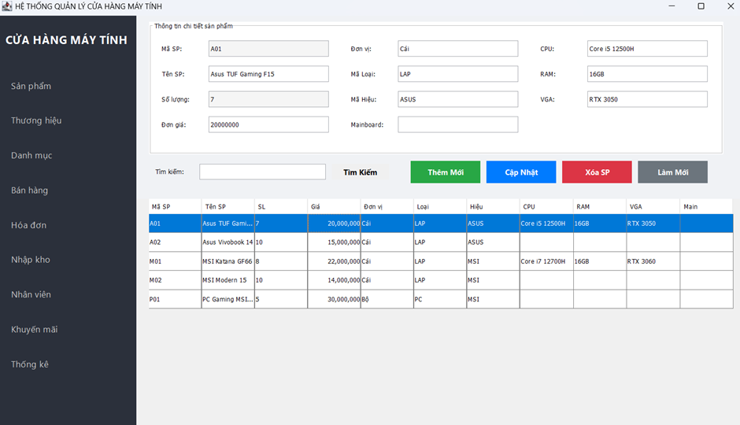
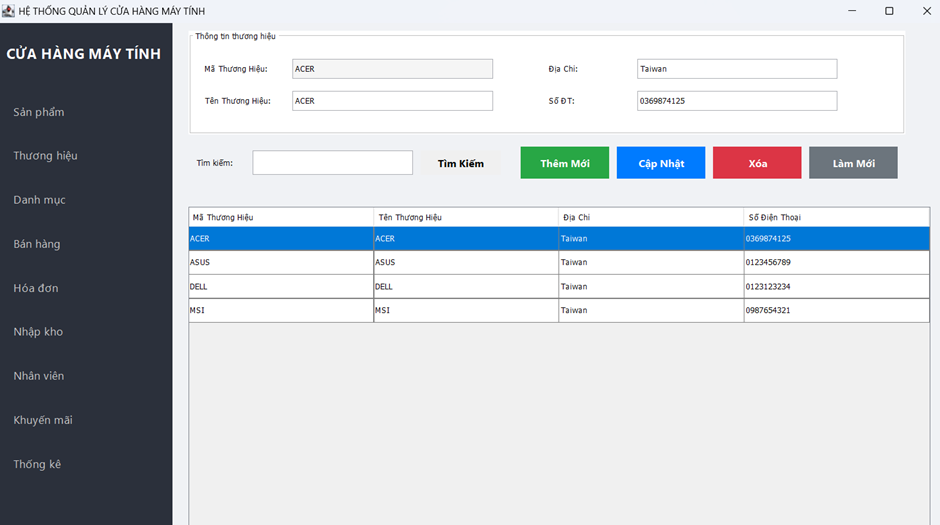
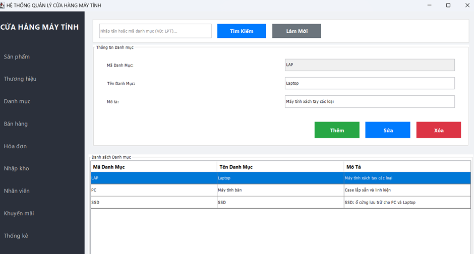
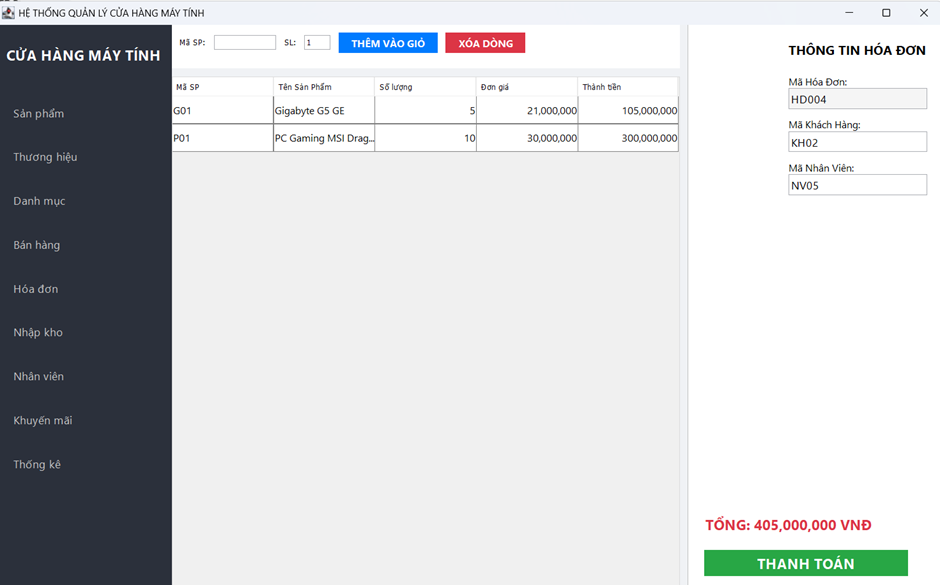
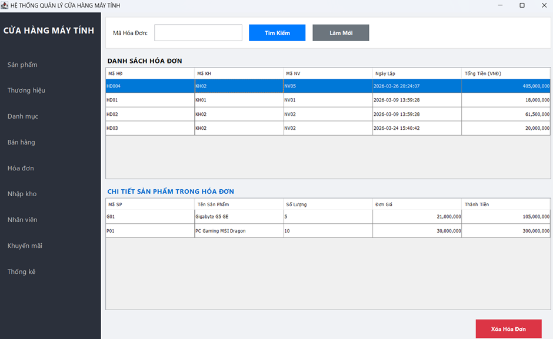
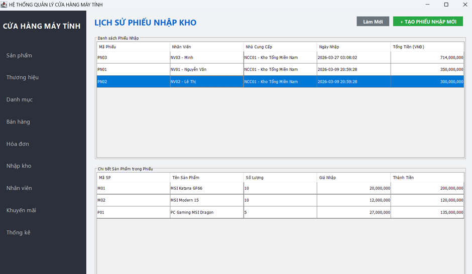
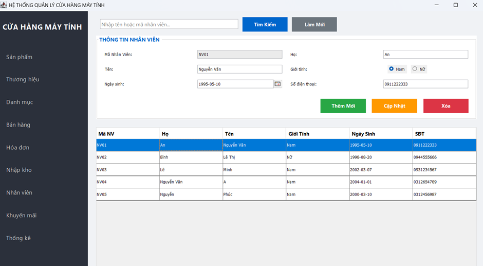

# Java_Computer_Store
## I. Hướng dẫn cài đặt

1. **Mã nguồn:** Các file source code nằm trong thư mục `src/`.
2. **Cơ sở dữ liệu:**
   - Tạo cơ sở dữ liệu trên MySQL mang tên `java_computer_store`.
   - Import file `java_computer_store.sql` để tạo cấu trúc hệ thống.
   - *(Tùy chọn)* Nếu muốn có dữ liệu mẫu tạm thời, hãy import thêm file `DBtest.sql`.
3. **Môi trường chạy:**
   - **IDE:** Phần mềm mở và chạy tốt nhất trên **Apache NetBeans IDE 29**.
   - **JDK:** Yêu cầu version **JDK 17** trở lên.

---

## II. Sơ đồ ERD & Mô tả hệ thống

 

> **Ý tưởng ban đầu:** Dựa trên bối cảnh thị trường giá linh kiện và đồ điện tử đang tăng cao, chúng tôi nhận thấy đây là một cơ hội kinh doanh đầy tiềm năng nên đã quyết định cùng nhau xây dựng hệ thống bán máy tính này.

**Mô tả hệ thống:**
Dựa trên cấu trúc database đã xây dựng, dưới đây là "cuộc đời" của một chiếc Laptop từ lúc nhập kho đến tay khách hàng qua 2 giai đoạn chính:

### Giai đoạn 1: Nhập hàng (Lấp đầy kho)
Khi cửa hàng quyết định nhập một lô Laptop Dell mới:
* **Khai báo:** Nhân viên kiểm tra xem mẫu Dell này đã có trong bảng Sản phẩm chưa. Nếu chưa, họ tạo mới một dòng thông tin.
* **Lập phiếu:** Một "Phiếu nhập hàng" (`PurchaseOrders`) được tạo ra, ghi nhận ai là người nhập (`StaffID`) và nhập từ nhà cung cấp nào (`SupplierID`).
* **Đổ hàng vào kho:** Khi xe tải chở hàng đến, nhân viên đếm số lượng và nhập vào `PurchaseOrderDetails`.
  * ⚡ **Phép màu Database:** Ngay khi nhấn "Lưu", **Trigger** mà chúng ta viết sẽ tự động "bơm" số lượng vào bảng `Products`. Cột `SubTotal` cũng tự tính tiền để kế toán biết phải trả nhà cung cấp bao nhiêu.

### Giai đoạn 2: Tiếp khách & Chốt đơn (Bán hàng)
Khách hàng bước vào cửa hàng:
* **Tư vấn:** Nhân viên mở bảng sản phẩm để giới thiệu thông số (CPU, RAM, VGA...) cho khách nghe.
* **Lên hóa đơn:** Khách đồng ý mua, nhân viên tạo một hóa đơn ghi tên khách và tên mình.
* **Quẹt mã vạch:** Nhân viên chọn sản phẩm khách mua vào `InvoiceDetails`.
  * ⚡ **Phép màu Database:** Hệ thống kiểm tra xem kho còn hàng không (nhờ lệnh `CHECK`).
    * Nếu còn, **Trigger** sẽ âm thầm trừ bớt sản phẩm trong kho đi.
    * Nếu có chương trình giảm giá, bảng `ProductPromotions` sẽ nhảy vào để tính lại giá tiền cuối cùng cho khách.

---

## III. Giao diện phần mềm

Dưới đây là hình ảnh thực tế của ứng dụng sau khi chạy file `MainGUI.java`:

### 1. Giao diện chính

### 2. Form Thương hiệu sản phẩm

### 3. Form Danh mục sản phẩm

### 4. Form Bán sản phẩm (POS)

### 5. Form Hóa đơn bán hàng

### 6. Form Lịch sử phiếu nhập kho

### 7. Form Quản lý nhân viên

...
